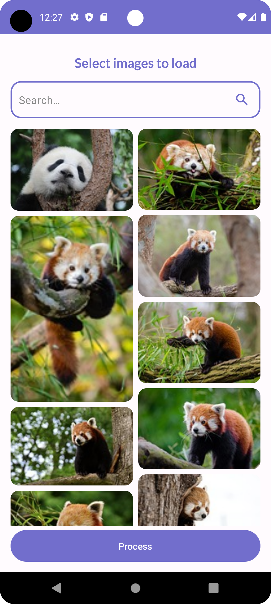
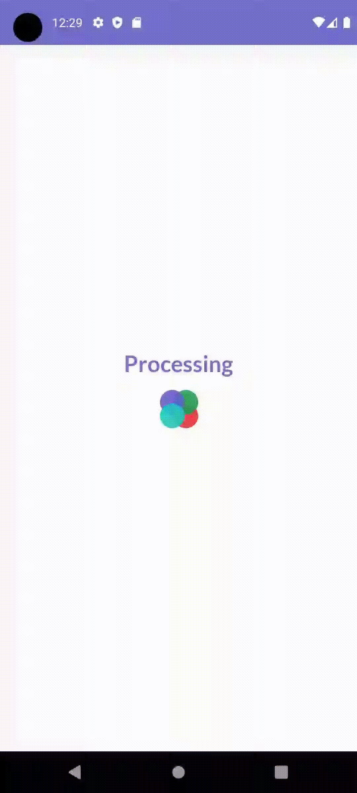
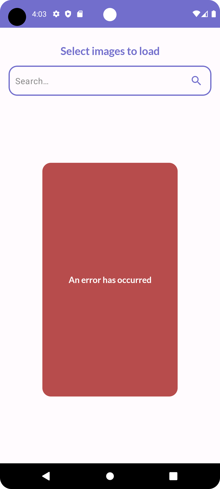

# WithingsCompose


## Preview Video

https://github.com/SimoJOUDAR/WithingsCompose/assets/80898080/c505ebb0-bab4-4934-b6b3-6ef10b9d4693

https://github.com/SimoJOUDAR/WithingsCompose/assets/80898080/b279057f-6ef4-46d0-b155-67ca84e92cb2

 -  -  -  - 


## Intro
This is an Android app for generating gif images.

It's a Jetpack Compose project that uses pixabay api to search for images using keywords and displays them on a grid.
The user has the option to select images from the grid and generate a gif image. The UI is responsive to different screen sizes and Light/Dark mode.

The app uses StateFlow for data transmission, LazyVerticalStaggeredGrid for grid display and WorkManager for bitmap processing. 

## Installation
Clone/Download this repository and open it with **Android Studio**
```bash
git clone https://github.com/SimoJOUDAR/WithingsCompose
```

Add your PIXABAY Api key to your local.properties file as follow
```bash
PIXABAY_API_KEY = your_key_here
```

## Run the App
Once the project opened, you can run the App using Android studio's AVD to execute it.

## Obfuscation
The source code has obfuscation and shrinkResources enabled. It uses an external obfuscation dictionary available at https://bit.ly/3uGrnSu

## Generating signed APK
From Android Studio:
1. Go to ***Build*** menu
2. Go to ***Build Bundle(s) / APK(s)***
3. Click on ***Build APK(s)*** The APK generated can be loaded and run on any Android phone.